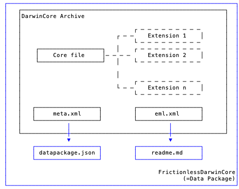

# Frictionless Darwin Core
A tool converting [Darwin Core Archive](https://en.wikipedia.org/wiki/Darwin_Core_Archive) into [Frictionless Data Package](https://frictionlessdata.io/specs/data-package/).

## Features
* **datapackage.json**: Ensure your DarwinCore archive complies with [Frictionless specifications](https://frictionlessdata.io/specs/)
* **README.md**: Add human readable metadata from [EML](https://en.wikipedia.org/wiki/Ecological_Metadata_Language)
* **Support all standards DarwinCore terms**
* **Fields constraints**: Enable further data validation, such as [goodtables](https://github.com/frictionlessdata/goodtables-py)
* **URL**: Accept DarwinCore Archive from local path or URL
* **Command line interface**

## Contents
<!--TOC-->
* [Getting Started](#getting-started)
    * [Installing](#installing)
    * [Running on CLI](#running-on-cli)
* [Documentation](#documentation)
    * [Rationale](#rationale)
    * [What it does?](#what-it-does)
    * [DarwinCore terms](#darwincore-terms)
    * [Test cases suite](#test-cases-suite)
* [Contributing](#contributing)
<!--TOC-->

## Getting Started
### Installing
```
pip install FrictionlessDarwinCore
```

### Running on CLI

```
# convert from local archive
fdwca myDwCA.zip

# convert from URL (archive accessible on internet)
fdwca https://ipt.biodiversity.be/archive.do?r=rbins_saproxilyc_beetles&v=9.37

# only generate JSON descriptor (datapackage.json)
fdwca myDwCA.zip --json datapackage.json

# only generate markdown human readable metadata (readme.md)
fdwca myDwCA.zip --md readme.md
```

## Documentation
### Rationale
**DarwinCore** standard, created and maintained by [Biodivesity Informatics Standards(aka TDWG)](https://www.tdwg.org/), is used to publish Life Sciences data about observations, collections specimens, species checklists and sampling events. DarwinCore Archive(DwCA), a bundle of biodiversity data and metadata files, is well established mechanism for publishing or using data in [Global Biodiversity Information Facility](https://www.gbif.org/) and other Life Sciences networks.

**Frictionless Data Package** is an emerging, domain agnostic, data standard that offers a variety of cross technology tools.

Bridging these two data ecosystems is our vision. This project is supported by [Open Knowledge Foundation](https://okfn.org/) and funded under the [Frictionless Data Tool Fund](https://toolfund.frictionlessdata.io/).

### What it does?
DarwinCore archives consist of:
* a **core** data file
* optionally, 1 or more **extension** data file(s)
* eml.xml: **metadata** written in Ecological Metadata Language
* meta.xml: the **structure** of the DarwinCore data files

This conversion tool appends two files to the archive, see diagram below:
* **datapackage.json**: data package descriptor of the data files
* **readme.md**: markdown, human readable, metadata


The tool can also generate these two files as separate outputs without touching the archive.

### DarwinCore terms
Darwin Core is a very persmissive standard some recommandations but almost no constraining rules. This [table](https://github.com/andrejjh/FrictionlessDarwinCore/blob/master/FrictionlessDarwinCore/fdwc_terms.csv) assigns Frictionless Data Package's type, format and constraints to every [Darwin Core term](https://dwc.tdwg.org/terms/).
Values that do not comply with these **Frictionless DarwinCore rules** will automatically raise warnings.

### Test cases suite
The initial [test cases suite](./testCases.md) covers a wide variety of Darwin Core usages. It should give enough confidence that basic incompatibilities are identified, reported and solved but it will not guarantee that all possible DwC Archives will automatically translate into valid Data Packages.

## Contributing
You are encouraged to contribute by identifying/reporting issues or incompatiblities and helping to solve them.

### Not familiar with Darwin Core?
Have a look at iDigBio's [Darwin Core Hour](https://www.idigbio.org/content/darwin-core-hour-webinar-series) Webinar Series.
